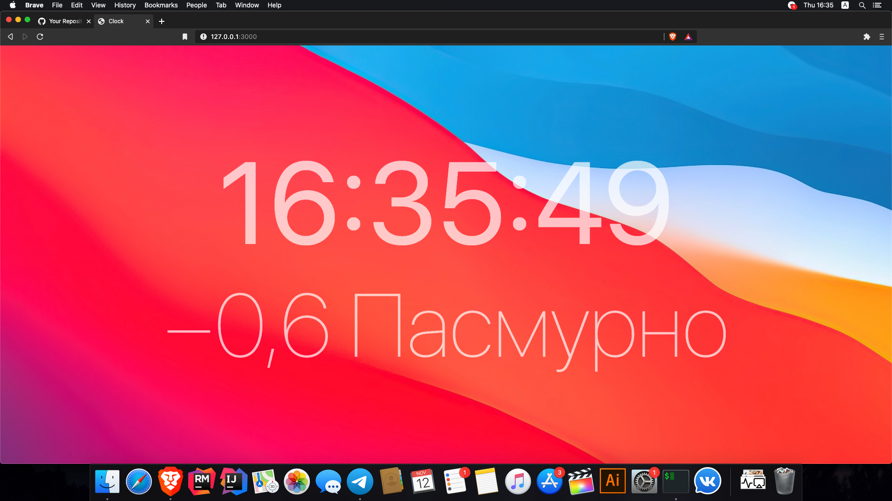

<h1>Realtime clock</h1>

<h2>All you need:</h2>
<ul>
<li>Install postgres</li>
<li>Install redis</li>
</li>
<h2>How to run:</h2>
<ul>
<li><b>$</b> bundle install</li>
<li><b>$</b> rails db:create</li>
<li><b>$</b> rails db:migrate</li>
<li><b>$</b> redis-server</li>
<li><b>$</b> bundle exec sidekiq</li>
<li><b>$</b> rails s</li>
</li>
